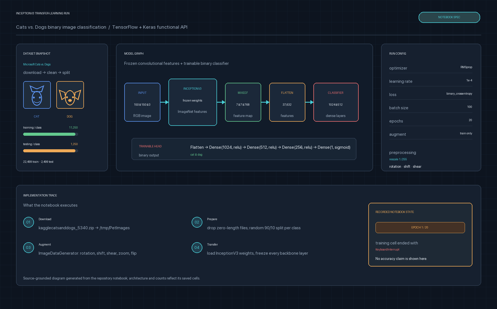
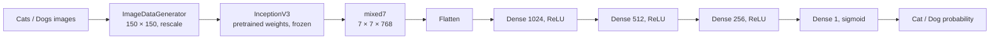

# Cats vs. Dogs InceptionV3 Transfer Learning

**Recommended repository name:** `cats-dogs-inceptionv3-transfer-learning`

**About:** A TensorFlow/Keras notebook that classifies cats and dogs with a frozen ImageNet-pretrained InceptionV3 backbone and a trainable dense binary-classification head.



## Overview

This project demonstrates **transfer learning for binary image classification** with TensorFlow and Keras. Instead of learning visual features from the beginning, the notebook reuses the convolutional representations learned by InceptionV3, freezes the pretrained backbone, and trains a task-specific classifier for the Microsoft Cats vs. Dogs dataset.

The workflow downloads and validates the dataset, removes zero-length files, creates a random 90/10 train/test split for each class, applies augmentation to training images, and feeds 150 × 150 RGB batches into the model. The classifier reads the `mixed7` feature map from InceptionV3, flattens it, and passes it through three ReLU layers before producing a single sigmoid probability for the cat/dog decision.

## Model pipeline



The model is assembled with the Keras Functional API. The saved InceptionV3 summary reports 21,802,784 parameters in the frozen base model; the trainable classification head is built on the `7 × 7 × 768` output of `mixed7`.

## Dataset and preprocessing

The notebook downloads the Microsoft Cats vs. Dogs archive and organizes it into the following directory structure:

```text
/tmp/cats-v-dogs/
├── training/
│   ├── cats/
│   └── dogs/
└── testing/
    ├── cats/
    └── dogs/
```

The saved notebook records the following split written by the split function:

| Split | Cats | Dogs | Total |
| --- | ---: | ---: | ---: |
| Training | 11,250 | 11,250 | 22,500 |
| Testing | 1,250 | 1,250 | 2,500 |

The split function skips two zero-length source files and writes 22,500 training entries and 2,500 testing entries. During generator construction, TensorFlow/Keras reports 22,499 usable training images and 2,499 usable validation images.

Training batches use:

- `target_size=(150, 150)` and `batch_size=100`
- binary labels from the class directories
- pixel rescaling with `1./255`
- random rotation, shifts, shear, zoom, and horizontal flips
- `fill_mode='nearest'`

Validation data is rescaled to `[0, 1]` without augmentation.

## Training configuration

The notebook compiles the model with RMSprop, binary cross-entropy, and accuracy:

```python
model.compile(
    optimizer=RMSprop(lr=0.0001),
    loss="binary_crossentropy",
    metrics=["acc"],
)

history = model.fit(
    x=train_generator,
    validation_data=validation_generator,
    epochs=20,
    verbose=2,
)
```

For current TensorFlow/Keras versions, replace the deprecated `lr` argument with `learning_rate=0.0001`.

## Running the notebook

The notebook downloads both the dataset and the InceptionV3 weights at runtime. It was written for a Colab-style environment and uses `/tmp` for its working data.

1. Install TensorFlow, Jupyter, and Matplotlib in a Python environment.
2. Open `Transfer_Learning_Image_Calssification.ipynb`.
3. Run the cells from top to bottom.
4. Allow time for the dataset, pretrained weights, and training loop to download and run.

The notebook’s final cells plot training and validation accuracy and loss after `history` has been produced.

## Reproducibility note

The committed notebook contains the dataset counts and InceptionV3 model summary. Its saved training cell was interrupted during epoch 1 of 20, so it does not contain a completed accuracy or loss history. Rerun the training cell to generate current metrics; the result will depend on the runtime, TensorFlow version, and random split.

## Project structure

```text
.
├── Transfer_Learning_Image_Calssification.ipynb
├── docs/
│   └── inceptionv3-transfer-learning-pipeline.png
└── README.md
```

## Engineering improvements

For a production-ready training workflow, the next useful improvements would be:

- set and record random seeds for the train/test split and data generators
- replace runtime downloads with configurable dataset and weight paths
- use `learning_rate` and a pinned TensorFlow environment
- add checkpoints, early stopping, and a final test evaluation
- report precision, recall, F1 score, a confusion matrix, and sample predictions
- move reusable preprocessing and training code out of the notebook
